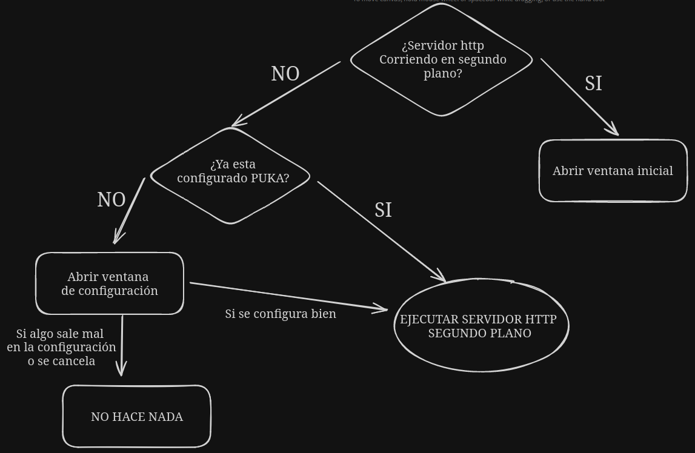

```textmate
/$$$$$$$  /$$   /$$ /$$   /$$  /$$$$$$          /$$   /$$ /$$$$$$$$ /$$$$$$$$ /$$$$$$$
| $$__  $$| $$  | $$| $$  /$$/ /$$__  $$        | $$  | $$|__  $$__/|__  $$__/| $$__  $$
| $$  \ $$| $$  | $$| $$ /$$/ | $$  \ $$        | $$  | $$   | $$      | $$   | $$  \ $$
| $$$$$$$/| $$  | $$| $$$$$/  | $$$$$$$$ /$$$$$$| $$$$$$$$   | $$      | $$   | $$$$$$$/
| $$____/ | $$  | $$| $$  $$  | $$__  $$|______/| $$__  $$   | $$      | $$   | $$____/
| $$      | $$  | $$| $$\  $$ | $$  | $$        | $$  | $$   | $$      | $$   | $$      
| $$      |  $$$$$$/| $$ \  $$| $$  | $$        | $$  | $$   | $$      | $$   | $$      
|__/       \______/ |__/  \__/|__/  |__/        |__/  |__/   |__/      |__/   |__/

```

Servicio de impresión para puntos de venta, utilizando http y comandos EscPOS.

## Indice

1. [Instalación y uso](#instalación-y-uso)
2. [Documentación API](#documentación-api-de-servicio-de-impresión)
   * [Descripcion](#descripción)
   * [Endpoints](#endpoints)
   * [Objetos solicitud](#objetos-dentro-de-body-en-cada-solicitud)
3. [Para desarrolladores](#para-desarrolladores)
   * [Estructura del proyecto](#estructura-del-proyecto)
   * [Construir el proyecto](#construir-el-proyecto)
4. [Generación de instaladores](#generación-de-instaladores)

## Instalación y uso

* PukaHTTP esta disponible para su descarga en su ultima
  version: [Pagina de descarga](https://www.jdeploy.com/gh/puyu-pe/puka-http).
* Despues de instalar, al abrir PukaHTTP por primera vez, se tendra que configurar la **IP** y el **Puerto** del
  servidor local http y una contraseña para acceder a la [ventana oculta](#ventana-oculta-de-configuración), opcionalmente se le puede configurar un logo que servira para la impresion de boletas y facturas.
    > IMPORTANTE!!: El **IP** tiene que ser el mismo ip que la maquina host (se puede averiguar con el comando **ipconfig** en windows y 
      **ifconfig** de net-tools en linux y mac).
      Por defecto Puka tratara de identificar la IP de la maquina host, pero puede no ser tan certero.
* Una vez hecho esto, si todo salio bien, el servidor http de puka deberia estar ejecutandose en segundo 
  plano, para comprobarlo puede abrir nuevamente puka y se abrira una [ventana](#ventana-inicial), si algo salió mal no se abrira esta [ventana](#ventana-inicial).
  Vea la el flujo de funcionamiento a continuación.
#### Flujo de trabajo puka


#### Ventana de configuración
Esta ventana solo tiene pensado abrirse una vez despues la primera instalación, a partir de esto ya no 
deberia volver a abrirse a menos que se hubiera borrado la configuración almacenada. En esta ventana se configura el Ip, puerto y
contraseña mencionados en la [instalación](#instalación-y-uso).

#### Ventana inicial
Es aquella ventana que se abre cuando ejecutas puka y ya esta corriendo el servidor http en segundo plano. 
[ver flujo de trabajo puka](#flujo-de-trabajo-puka).

#### Ventana de pruebas de impresión
A esta ventana se puede acceder mediante un boton ubicando en la [ventana inicial](#ventana-inicial)
Se puede probar en diferentes ticketeras y configuraciones, util para luego configurar los 
[objectos solicitud](#objetos-dentro-de-body-en-cada-solicitud).

#### Ventana oculta de configuración
Es una ventana a la cual se puede acceder haciendo click en el **numero de version** situada en la
[ventana inicial](#ventana-inicial) y pedira una contraseña la cual se configuro la . En esta ventana se puede parar el servidor http en segundo plano y tambien volverlo
a ejecutar, asi mismo se puede abrir los directorios donde esta situado los logs y la configuración.

### Uso

* PukaHTTP funciona como un servidor http, por lo tanto una vez que se este ejecutando en segundo plano
se le puede mandar tickets mediantes peticiones POST, tambien tiene otras
caracteristicas, [ver Documentación api](#documentación-api-de-servicio-de-impresión). 
* Cuenta con un modulo de pruebas de impresión en la 
[ventanas de pruebas de impresión](#ventana-de-pruebas-de-impresión).
* Se puede reimprimir o eliminar tickets en cola en la [ventana inicial](#ventana-inicial).
* Se puede reiniciar el servidor http en la [ventana oculta](#ventana-oculta-de-configuración).

## Documentación API de servicio de impresión

### Descripción

La url del servicio de impresión varia en función de la Ip y el puerto en la que se instalo en el [proceso de instalación](#instalación-y-uso).
  * La estructura de la url es de la forma: `http://ip:port/endpoint`
    * ip: Ip donde se configuro puka en la [instalación](#instalación-y-uso)
    * port: Puerto donde se configuro puka en la [instalación](#instalación-y-uso)
    * endpoint: Alguna ruta de la api, [ver endpoints](#endpoints)

### Endpoints

#### 1. Impresoras del sistema: `/printer/system`

- **Método HTTP:** `GET`
- **Descripción:** Devuelve un array con las impresoras intaladas en el sistema.
- **Respuesta exitosa:**
  - **Type:** `text`
  - **Código:** `200`
  - **Cuerpo:**
    ```text
    service online
    ```
- **Respuesta de error:**
  - **Type:** `json`
  - **Código:** `400 - 500`
  - **Cuerpo:**
    ```json
    {
        "error": "Excepción ocurrida en el servidor",
        "status": "error",
        "message": "Algun mensaje contextual"
    }
    ```

#### 2. Abrir caja: `/printer/open-drawer`

- **Método HTTP:** `POST`
- **Descripción:** Abre la caja registradora asociada a una ticketera especifica.
- **Cuerpo de la solicitud :**
  El body tiene que ser el [objeto printer](#objeto-printer):
- **Respuesta exitosa:**
  - **Type:** `json`
  - **Código:** `200`
  - **Cuerpo:**
    ```json lines
    {
        "status": "success",
        "message": "Operación exitosa al abrir caja.",
    }
    ```
- **Respuesta de error:**
  - **Type:** `json`
  - **Código:** `400 - 500`
  - **Cuerpo:**
    ```json lines
    {
      "status": "error",
      "message": "Alguna execpión ocurrio en el servidor.",
      "error": "Descripción del error."
    }
    ```

#### 3. Imprimir tickets: `/printer/ticket`

- **Método HTTP:** `POST`
- **Descripción:** Imprime boletas, facturas, notas de venta, etc.
- **Cuerpo de la solicitud :**
  El body tiene que ser un objeto que contenga al [objeto printer](#objeto-printer)
  y tambien los demas campos segun [JTicketDesing](https://github.com/puyu-pe/JTicketDesign?tab=readme-ov-file#estructura-general),
  mas detalles en [Objecto ticket](#objeto-ticket).
- **Respuesta exitosa:**
  - **Type:** `json`
  - **Código:** `200`
  - **Cuerpo:**
    ```text 
    {
      "status": "success",
      "message": "Trabajo de impresión no lanzo ningun error.",
      "data": 0 //Es el número de elementos en cola
    }
    ```
- **Respuesta de error:**
  - **Type:** `json`
  - **Código:** `400 - 500`
  - **Cuerpo:**
    ```json lines
    {
        "status": "error",
        "message": "Alguna excepción del lado del servidor",
        "error": "Mensaje de excepción"
    }
    ```

#### 4. Eliminar tickets en cola: `/printer/ticket`

- **Método HTTP:** `DELETE`
- **Descripción:** Elimina tickets que hayan quedado en cola.
- **Respuesta exitosa:**
  - **Type:** `json`
  - **Código:** `200`
  - **Cuerpo:**
    ```text
    {
      "status": "success",
      "message": "Se libero todos los tickets en memoria",
      "data": 0 //Es el número de elementos en cola
    }
    ```
- **Respuesta de error:**
  - **Type:** `json`
  - **Código:** `400 - 500`
  - **Cuerpo:**
    ```json lines
    {
        "status": "error",
        "message": "Alguna excepción del lado del servidor",
        "error": "Mensaje de excepción"
    }
    ```

#### 5. Reimprimir tickets en cola: `/printer/ticket/reprint`
- **Método HTTP:** `GET`
- **Descripción:** Reimprime tickets que hayan quedado en cola.
- **Respuesta exitosa:**
  - **Type:** `json`
  - **Código:** `200`
  - **Cuerpo:**
    ```text 
    {
      "status": "success",
      "message": "La operacion se completo exitosamente",
      "data": 0 // numero de elementos en cola
    }
    ```
- **Respuesta de error:**
  - **Type:** `json`
  - **Código:** `400 - 500`
  - **Cuerpo:**
    ```json
    {
        "status": "error",
        "message": "Alguna excepción del lado del servidor",
        "error": "Mensaje de excepción"
    }
    ```
#### 6. Obtener tickets en cola: `/printer/ticket/queue`
- **Método HTTP:** `GET`
- **Descripción:** Devuelve tickets en cola.
- **Respuesta exitosa:**
  - **Type:** `json`
  - **Código:** `200`
  - **Cuerpo:**
    ```text 
    {
      "status": "success",
      "message": "Operacion completada exitosamente",
      "data": 0 //Representa el número de elementos en cola
    }
    ```
- **Respuesta de error:**
  - **Type:** `json`
  - **Código:** `400 - 500`
  - **Cuerpo:**
    ```json 
    {
        "status": "error",
        "message": "Alguna excepción del lado del servidor",
        "error": "Mensaje de excepción"
    }
    ```
#### 7. Obtener eventos cola de impresión websockets: `/printer/ticket/queue/events`
Al conectarnos a este endpoint mediante websockets, obtendremos actaulizaciones en tiempo real
sobre los elementos en cola, el mismo mecanismo que se utiliza en la [ventana inicial](#ventana-inicial) para ver 
el número de tickets en cola en tiempo real.

### Objetos dentro de body en cada solicitud
Ya sea para abrir la caja, o enviar tickets se necesita enviar datos en el 
body de la solicitud para que las operaciones se ejecuten segun los esperado. A continuación 
se especifica algunos detalles sobre la estructura de los objetos json 
que deben ir en body.

#### Objeto Printer
  ```text
   {
     name_system: "Alguna impresora instalada, red, serial o samba",
     port: 9100, // Puerto si es una impresora en red
     type: "Tipo de interfaz"
   }
  ``` 
  - **name_system:**
    Puede ser uno de los tres siguientes:
    - Nombre de la impresora instalada en el sistema
    - Ip de la ticketera en red
    - Protocolo samba, ejemplo: \\\192.168.1.53\tickets
    - Puerto serial, ejemplo: com6, com5, com4, etc.
  - **port:**
    Representa el puerto en caso **name_system** sea una ticketera en red
  - **type:**
    Se cuenta con soporte para:
    - Para impresoras instaladas en el sistema
      - windows-usb
      - linux-usb
      - samba: (Impresoras compartidas instaladas en el sistema)
      - cups: (Impresoras instaladas en sistemas linux con cups)
    - Otros
      - smbfile: Protocolo samba ejm: \\\192.168.1.53\tickets
      - serial
      - ethernet

#### Objeto Ticket
Es un objeto json que tiene consigo información del impresora destino [objecto printer](#objeto-printer), 
la data que se tiene que imprimir , el tipo de documento.
En [JTicketDesing](https://github.com/puyu-pe/JTicketDesign) se puede obtener mas información para
personalizar la gran parte del objeto ticket, a excepción del [objeto printer](#objeto-printer), Incluso hay algunas
propiedades adicionales para el [objeto printer](#objeto-printer) en [caracteristicas configurables de jticketdesing](https://github.com/puyu-pe/JTicketDesign?tab=readme-ov-file#caracteristicas-configurables).

> Importante!!: JTicketDesing ya viene integrado en puka, solo tiene que revisarse la documentación para obtener detalles sobre como 
> configurar el **objeto json ticket** final.


##### Estructura final de Objeto json ticket
[Ver ejemplos de tickets en jticketdesing](https://github.com/puyu-pe/JTicketDesign?tab=readme-ov-file#ejemplos-de-json-validos) 
para ver ejemplos de ticket json real. El objeto ticket en general se veria asi:
```text
{
    type: "tipo de documento (ver JTicketDesing)",
    printer: {
      name_system: "Alguna impresora instalada, red, serial o samba",
      port: 9100, // Puerto si es una impresora en red
      type: "Tipo de interfaz",
      // demas propiedades opcionales de printer
    },
    data: {
      // Data en funcion de JTicketDesing ...
    },
}
```

## Para desarrolladores

### Estructura del proyecto

- PukaHTTP
  - installers (Scripts de generación de instaladores de forma manual)
  - src (Código fuente)
    - main
      - java
        - pe.puyu.pukahttp
          - app (Clase Aplicacion JavaFX)
          - model (JavaFX beans)
          - services (Servicios en puka)
            - printer (Servicio de impresión)
            - printingtest (Servicio de pruebas de impresión)
            - api (Api http)
          - util (helpers)
          - validations (Validador parametros de conexión a bifrost)
          - views (Controladores JavaFX)
          - AppLauncher.java (Clase principal)
      - resources
        - pe.puyu.pukahttp
          - assets (Iconos)
          - fonts (Fuentes de texto)
          - styles (Estilos css javafx)
          - testPrinter (Modelos json pruebas de impresión)
          - views (Vistas FXML JavaFX)
  - .env.example (Ejemplo de configuración .env)
  - pom.xml (Declaración de dependencias y plugins compilación)
  - package.json (Configuración jDeploy package)
  - update-package.sh (Script de actualización version package version)

### Construir el proyecto

* Prerequisitos:
  * [JAVA openjdk 17 o superior](https://ed.team/blog/instalar-openjdk-en-linux).
  * [Apache Maven](https://ubunlog.com/apache-maven-instalacion-ubuntu/) , algunos IDE's ya tren maven incluido, ejm.
    Intellij IDEA. (Aunque se recomienda su instalación independiente del IDE)

1. Clonar el repositorio<br>
   Utilizando su IDE favorito o por medio de linea de comandos.
   ```
   git clone git@github.com:puyu-pe/puka-http.git
   ```

2. Ejecutar proyecto<br>
   Utilando su IDE favorito debe ejecutar la acciones maven clean
   compile y javafx:run, o por medio de linea de comandos:
   ```
   mvn clean compile javafx:run
   ```

## Generación de instaladores

Existe dos formas en la que podemos generar los instaladores para windows, mac y distribuciones linux.
Siendo la mas sencilla y recomedada JDeploy, por que automatiza de mejor forma la generación de instaladores,
y trae integrado un mecanismo de actualización automatica para las aplicaciones y tambien integración con github
actions.
Sin embargo por razones historicas tambien existe JPackage, este modo con el tiempo quedara deprecado debido a que se
esta
migrando toda la generación de instaladores a JDeploy.

1. [Generar instaladores con JDeploy](docs/jdeploy.md)
2. [Generar instaladores con JPackage](docs/jpackage.md)


